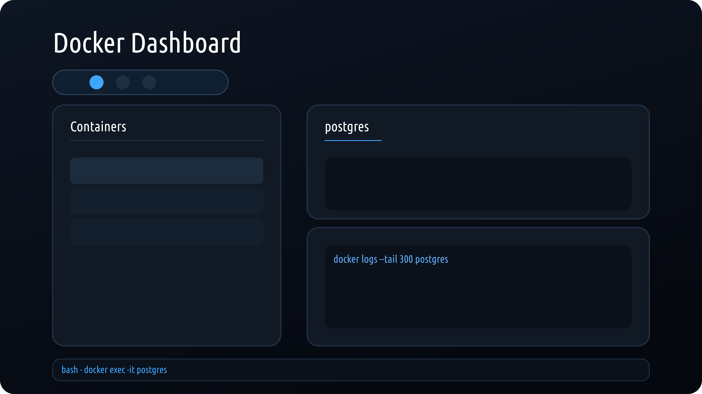

# Monotainer: Docker Dashboard

Monotainer brings Docker straight into your editor — Cursor-ready and compatible with hosts that support extension API version 1.99. Containers, images, and volumes live in a single panel, accessible via **Monotainer: Open Dashboard**.

## Usage

1. Install from the Marketplace (search for “Monotainer”), then run `Cmd/Ctrl + Shift + P` → `Monotainer: Open Dashboard`.
2. Or install locally:
   - `Cmd/Ctrl + Shift + P` → `Extensions: Install from VSIX…` → select the packaged `.vsix` file.
   - `Cmd/Ctrl + Shift + P` → `Monotainer: Open Dashboard`.

## Highlights

- **Unified overview** of containers, images, and volumes with independent scrolling and counters.
- **Container controls**: start, restart, stop, remove, and instant `docker exec`, plus a “Load more logs” button that appends additional log chunks.
- **Detailed insights**: tabs for Logs, Inspect, and Stats; images show `docker image history`, volumes show `docker volume inspect`.
- **Flexible interface**: draggable split view between list and details, scale selector (70–100%).
- **Localization**: English and Russian at launch with runtime switching.
- **Minimal dependencies**: relies only on your local Docker CLI.

## Preview

> Left — container list. Right — details. “Load more logs” keeps the log view streaming without leaving the editor.

## Requirements

- Host editor compatible with extension API version 1.99 or newer (Cursor friendly).
- Docker CLI available in `PATH`.
- Node.js 18+ only if you plan to build from source.

## Feedback

Bugs and ideas are welcome on GitHub: [github.com/monosyde/monotainer](https://github.com/monosyde/monotainer).

---

# Monotainer: Docker панель

Monotainer переносит управление Docker прямо в ваш редактор — подходит для Cursor и других совместимых решений. Контейнеры, образы и тома доступны по команде **Monotainer: Open Dashboard**.

## Использование

1. Установка из маркета (поиск по “Monotainer”), затем `Cmd/Ctrl + Shift + P` → `Monotainer: Open Dashboard`.
2. Локальная установка:
   - `Cmd/Ctrl + Shift + P` → `Extensions: Install from VSIX…` → выбрать собранный `.vsix`.
   - `Cmd/Ctrl + Shift + P` → `Monotainer: Open Dashboard`.

## Ключевые функции

- **Единый обзор** контейнеров, образов и томов с независимыми скроллами и счётчиками.
- **Управление контейнерами**: запуск, стоп, рестарт, удаление, `docker exec`, а также кнопка «Load more logs» для догрузки логов.
- **Подробности**: вкладки Logs, Inspect, Stats; образы показывают `docker image history`, тома — `docker volume inspect`.
- **Гибкий UI**: перетаскиваемый разделитель и селектор масштаба (70–100%).
- **Локализация**: английский и русский, переключение внутри панели.
- **Минимум зависимостей**: нужен только установленный Docker CLI.

## Предпросмотр

## Требования

- Редактор с поддержкой API версии 1.99.0 и выше (совместимо с Cursor).
- Docker CLI доступен в `PATH`.
- Node.js 18+ нужен только для сборки из исходников.

## Обратная связь

Пишите о багах и предложениях в репозиторий: [github.com/monosyde/monotainer](https://github.com/monosyde/monotainer).
